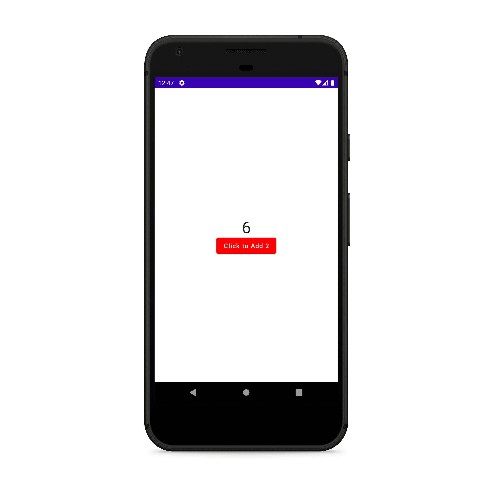

# `Jetpack Compose Source Codes`

## [Counter App Source Code](https://github.com/desi-programmer/jetpack_compose/blob/main/jetpack_counter/app/src/main/java/com/example/jetpack_counter/MainActivity.kt)

## [Source Code](https://github.com/desi-programmer/jetpack_compose/blob/main/LoginUI/app/src/main/java/com/example/loginui/MainActivity.kt)

## [Source Code](https://github.com/desi-programmer/jetpack_compose/blob/main/BookUI/app/src/main/java/com/example/bookui/MainActivity.kt)

